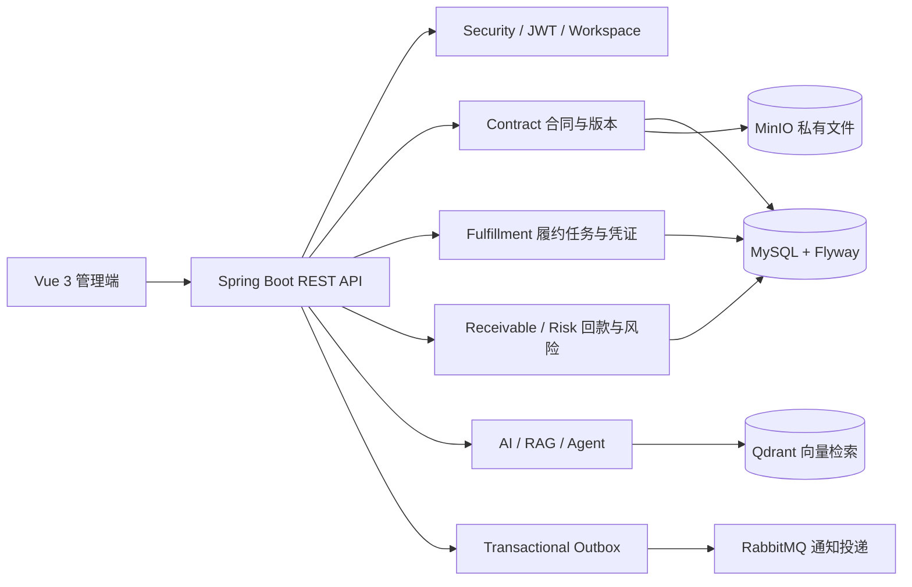
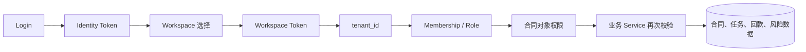
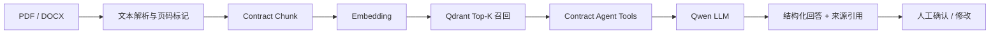

# 契约智控

[](https://github.com/rEalsBooker/contract-lifecycle-platform/actions/workflows/ci.yml)

> 企业合同履约与回款风险管理平台

契约智控是一个面向企业项目合同的 B2B SaaS 管理平台，由个人独立开发，用于实践 Java 后端、AI 应用落地和完整的软件工程流程。

它不只保存合同文件，而是把合同中的付款、交付、验收、开票和续签约定转化为可跟踪的履约任务，并持续记录凭证、回款和风险状态。

## 项目价值

企业签订合同后，真正容易发生的问题通常不是“合同找不到”，而是：付款节点无人跟进、交付或验收延期、履约凭证缺失，以及回款逾期后没有及时升级处理。

本项目围绕“合同条款 → 履约任务 → 凭证审核 → 回款跟踪 → 风险预警”建立业务闭环。

## 系统架构



## 权限调用链



所有合同、任务、文件、凭证、回款和风险查询都必须带租户上下文，并在 Service 或 Mapper 查询边界继续校验 Membership 和对象权限。

## AI 调用链



AI 解析、问答和风险提示都属于辅助能力。模型输出会保留来源依据，并通过当前用户的合同权限限制可查询的数据范围。

## 核心业务闭环

```text
合同上传
  → 合同版本与条款确认
  → 生成履约任务
  → 分配执行人与审核人
  → 任务执行与凭证上传
  → 凭证审核 / 驳回重提
  → 应收计划与回款登记
  → 逾期计算与风险预警
  → 通知投递与审计记录
```

## 当前已实现

### 企业与权限

- 登录、JWT 身份认证和企业工作空间选择；
- Membership 成员关系和预置角色权限；
- 合同、任务、凭证、回款和风险数据的租户隔离；
- 成员启停、合同读取授权和站内通知；
- 审计日志记录关键业务操作。

### 合同与履约

- 合同草稿创建和 PDF/DOCX 私有文件上传；
- 受控文件下载和本地 / MinIO 存储切换；
- 合同条款人工录入、修改、确认和发布；
- 根据确认条款生成履约任务草稿；
- 任务领取、开始执行、完成和凭证上传；
- 指定不同成员进行凭证审核；
- 审核通过、驳回重提和审核通知；
- 任务内部计划延期申请与异人审批；
- 合同候选版本、变更确认、完成前置检查、终止、归档和解档。

### 回款与风险

- 应收计划登记；
- 回款登记和发票状态记录；
- 到期与逾期计算；
- 风险处置和工作台汇总；
- 企业范围内的通知、已读状态和可追溯操作记录。

### AI 与 RAG

- PDF/DOCX 合同文本提取；
- AI 条款发现项和来源页码标记；
- AI 解析失败重试和人工审阅模式；
- AI 发现项人工修改、确认和驳回；
- 按合同版本切分文本 Chunk 并建立 Qdrant 向量索引；
- 按租户、合同和版本过滤向量召回；
- 保留页码和原文片段作为回答依据；
- 基于 LangChain4j `@Tool` 的合同风险问答；
- Tool 查询继续复用已有 Service 权限校验。

AI 只提供辅助提取、问答和风险提示，不替代律师出具法律意见，也不直接判断合同是否合法。未配置模型密钥时，系统会明确进入人工审阅模式，不伪造 AI 结果。

## 技术架构

当前采用模块化单体，不强行拆分微服务：

```text
Vue 3 + Vite
        │ REST / JSON
        ▼
Spring Boot 3.4 + MyBatis
        │
        ├─ 合同与版本模块
        ├─ 履约任务与凭证审核模块
        ├─ 应收、回款与风险模块
        ├─ 身份、Membership 与权限模块
        ├─ 通知与 Outbox 模块
        └─ AI 解析、RAG 与 Tool Calling 模块
        │
        ├─ MySQL + Flyway
        ├─ RabbitMQ（可切换）
        ├─ MinIO（可切换）
        └─ Qdrant（RAG 向量检索）
```

## 技术栈

### 后端

- Java 17
- Spring Boot 3.4
- Spring MVC / Validation / Security
- MyBatis
- Flyway
- JWT
- Maven

### 数据库与基础设施

- MySQL 8 + Flyway
- RabbitMQ
- MinIO
- Qdrant
- Docker Compose

Redis 已由 Docker Compose 提供运行环境，但当前核心业务代码暂未依赖 Redis，后续可用于缓存或限流扩展。

### 前端

- Vue 3
- TypeScript
- Vite
- Vue Router

### AI

- LangChain4j
- 千问 OpenAI 兼容接口
- Embedding：`text-embedding-v4`
- Qdrant 向量检索
- 结构化 AI 解析结果
- 权限受控 Tool Calling

## 目录结构

```text
contract-lifecycle-platform/
├─ docs/                              # 需求、范围、技术设计和 UI 原型说明
├─ server/                            # Spring Boot 后端
│  ├─ src/main/java/.../ai/           # AI 解析、RAG、Agent、助手
│  ├─ src/main/java/.../contract/     # 合同与版本
│  ├─ src/main/java/.../fulfillment/  # 任务与凭证审核
│  ├─ src/main/java/.../receivable/   # 应收、回款和发票
│  ├─ src/main/java/.../risk/         # 风险评估与处置
│  ├─ src/main/java/.../identity/     # 登录、租户和成员权限
│  ├─ src/main/java/.../notification/ # Outbox 与通知
│  └─ src/main/resources/db/migration/ # Flyway 数据库迁移
├─ web/                               # Vue 3 管理端
├─ docker-compose.yml                 # MySQL、Redis、RabbitMQ、MinIO、Qdrant
├─ .env.example                       # 本地配置模板，不包含真实密钥
└─ README.md
```

## 本地运行

### 1. 准备环境

- JDK 17+
- Maven 3.9+
- Node.js 20+
- Docker Desktop

### 2. 配置环境变量

复制根目录模板：

```powershell
Copy-Item .env.example .env
```

然后填写本地数据库密码和 AI Key。`.env` 已被 Git 忽略，禁止提交真实密钥。

AI 相关配置主要包括：

```env
APP_AI_API_KEY=your-qwen-api-key
APP_AI_PROVIDER=qwen
APP_AI_MODEL_NAME=qwen3.8-flash
APP_AI_BASE_URL=https://dashscope.aliyuncs.com/compatible-mode/v1
```

### 3. 启动基础设施

```powershell
docker compose --env-file .env up -d
```

默认服务端口：

| 服务 | 地址 |
|---|---|
| MySQL | `localhost:3307` |
| Redis | `localhost:6379` |
| RabbitMQ | `localhost:5672` |
| RabbitMQ 管理台 | `http://localhost:15672` |
| MinIO API | `http://localhost:9000` |
| MinIO 控制台 | `http://localhost:9001` |
| Qdrant | `http://localhost:6333` |

### 4. 启动后端

```powershell
cd server
mvn spring-boot:run
```

也可以在 IntelliJ IDEA 中运行 `ContractLifecycleApplication`。

### 5. 启动前端

```powershell
cd web
npm install
npm run dev
```

前端默认地址：`http://localhost:5173`

## 本地演示账号

空数据库首次启动时会准备演示账号：

| 账号 | 密码 | 用途 |
|---|---|---|
| `admin` | `ChangeMe123!` | 企业管理员、合同负责人、财务人员 |
| `reviewer` | `ChangeMe123!` | 模拟审核人，用于双账号凭证审核演示 |

仅允许在本地演示环境使用，禁止用于生产环境。

## 验证命令

后端测试：

```powershell
cd server
mvn test
```

前端构建：

```powershell
cd web
npm run build
```

健康检查：

```text
GET http://localhost:8080/api/v1/health
```

## 文档入口

- [项目范围](docs/project-scope.md)
- [业务需求](docs/requirements-v0.1.md)
- [UI 原型说明](docs/ui-prototype-brief-v0.1.md)
- [技术设计](docs/technical-design-v0.1.md)

## 运行截图

当前仓库暂未提交截图素材，不在 README 中虚构图片。后续如果需要补充演示截图，建议手工截取：

- 企业工作台：任务完成率、应收余额和风险摘要；
- 合同详情 / AI 解析：来源页码、人工修改和确认入口；
- 履约任务：执行人、审核人、凭证审核和驳回重提；
- 回款与风险：应收计划、逾期状态和风险处置。

## 项目边界

- 当前是个人独立开发项目，不代表真实企业生产系统；
- AI 结果必须经过人工确认，不作为法律意见；
- 示例合同和账号仅用于本地演示；
- 当前优先保证模块化单体的业务闭环，不为展示技术而强行引入微服务；
- 移动端 App、在线支付和生产级多地域部署暂不属于当前 MVP。

这些内容均应以当前代码、测试和实际演示结果为准，不应把规划中的能力描述为已完成能力。
